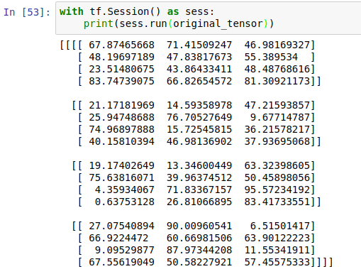
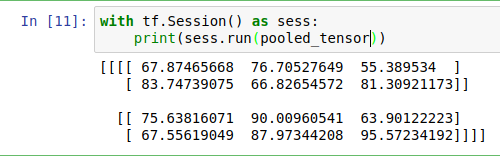
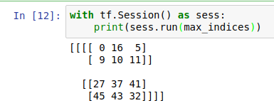
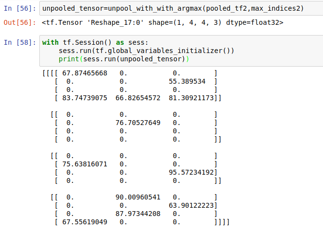

**Credits** :: [Tensorflow's Issue No 2169](https://github.com/tensorflow/tensorflow/issues/2169) and all the people invloved there.

# Unpooling in Tensorflow
Unpooling of tensor that has been pooled using max_pool_with_argmax

### What is unpooling ?

#### It's a tensor operation which tries to regenerate the tensor which has been maxpooled .

This figure below illustrates it perfectly 


More on max pooling here ::[Max Pooling](http://cs231n.github.io/convolutional-networks/#pool)

The original paper on unpooling :: [Unpooling](https://arxiv.org/pdf/1311.2901v3.pdf)


Some more resources one may find useful::

1. [Broadcasting in Numpy](http://eli.thegreenplace.net/2015/broadcasting-arrays-in-numpy/)
2. [Scatter in tensorflow](https://www.tensorflow.org/api_docs/python/tf/scatter_nd_update)
3. [Cocatanation in Tensorflow](https://www.tensorflow.org/api_docs/python/tf/concat)
3. [Max Pool with Arg Max in Tensorflow](https://www.tensorflow.org/api_docs/python/tf/nn/max_pool_with_argmax)


**Example Usage ::**

1. Declare a tensor 
```python
original_tensor = tf.random_uniform([1,4,4,3],maxval=100,dtype='float32',seed=2)
```
2. Use the max pool with arg max function to pool the tensor
```python
pooled_tensor,max_indices=tf.nn.max_pool_with_argmax(original_tensor, ksize=[1,2,2,1], strides=[1,2,2,1], padding='SAME')
```
3. Now armed with ```pooled_tensor``` and ```max_indices```  you can call the ```unpool_with_argamx``` function !
```python
unpooled_tensor=unpool_with_with_argmax(pooled_tensor,max_indices)
```
4. It's done !

**Lets have a look at it**

1. **Original Tensor**


---
---
2. **Pooled Tensor**


---
---
3. **Max Indices**


---
---
4. **And finally the **Unpooled Tensor****

